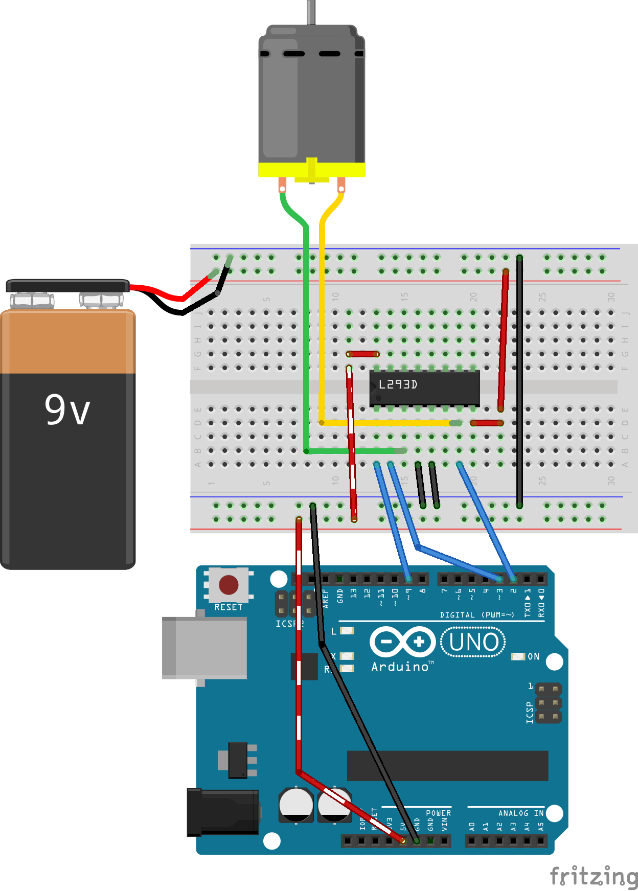

B_FURIOUS
=========

This is the code and simple circuit diagram for a wifi-enabled 
remote control car driven by an Arduino Uno + Arduino WiFi Shield.
The base for our car is a toy RC car called the 
[B-Furious](http://www.toysrus.com/buy/rc-trucks-buggies-off-road/fast-lane-b-furious-radio-control-vehicle-49-mhz-colors-vary-5f5e1f1-12456731),
which is driven by one DC motor and can move forwards or backwards,
but cannot turn left or right.

**The motor driver circuit and code work effectively, but we
could not make the wifi shield work consistently enough
to drive the car.**

## Motor Control Circuit
We adapted our circuit from the Arduino starter kit's 'Zoetrope'
project (project #10), which controls a DC motor's direction
and speed via buttons and a potentiometer. We left the Arduino's
output signals, the H-bridge, and the power supplies in place, 
but swapped out the buttons
and pot for HTTP requests processed by a small server running
on the Arduino.

The three blue wires in the schematic below are what carry
signals from the Arduino to the motor. The leftmost wire,
from Arduino pin #9 to the lower-left pin of the H-bridge,
is an on/off switch. The other two wires control the direction:
the motor turns forward if the left one is HIGH and the right
one is LOW and vice-versa. The speed is controlled by
a parameter passed in the HTTP request.

Note: we used an L293DNE H-bridge, not the LD293D depicted in the schematic.

## Arduino Sketch
The most up-to-date version of the code is in 
CurrentReceiver/CurrentReceiver.ino.

Function | Action Performed
---------|-----------------
`setup()` | Runs `wifiSetup()` and `motorSetup()`
`wifiSetup()`| Connects to the wireless network
`printWiFiStatus()` | Prints Arduino's IP address and signal strength
`motorSetup()` | Puts the Arduino control pins in output mode
`loop()` | Waits for requests and processes them
`parseClientInput()`| Splits the incoming HTTP GET request into on/off, direction, and speed parameters.
`motorControl()`| Sets the motor's speed and direction

### Controlling the Car

The car can be controlled via CURL:

    curl -G http://<Arduino's-ip-address> <params>

`<params>` is a string of integers.
* The first integer, 0 or 1, indicates whether the motor is to be turned on or off.
* The second integer, 0 or 1, indicates the motor's direction.
* the third integer, 000 to 255, indicates the motor's speed.

For example,

    curl -G http://<ip-address> 11255

sends the car forward at top speed.

    curl -G http://<ip-address> 10020

moves the car backward very slowly.

    curl -G http://<ip-address> 01255
    curl -G http://<ip-address> 00000
    curl -G http://<ip-address> 00125

All of the above (and anything else beginning with a zero) turn the motor off.

### Project Status and Further Ideas
While our own code and circuit are functional, we were
never able to drive our car because of problems with the Arduino's 
wifi shield. We had to restart everything any time
the Arduino disconnected from the wireless network, which happened
frequently enough that it rendered the car unusable.

We did experiment with the [Spark Core](https://www.spark.io/),
an alternative microcontroller with built-in wifi. It showed promise,
but had its own problems. After a couple of weeks of finicking with
the hardware, we decided to drop the project.
